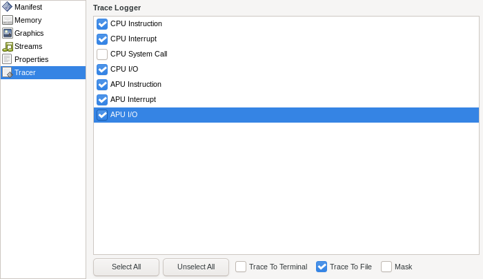
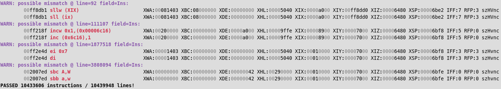

# ghidra-tlcs900h

Ghidra processor module for Toshiba TLCS-900/H.

Tested with version 10.3.2.

## Status

Work in progress:

* Instruction set should be fully disassembled, if you notice anything missing, please open an issue / pull request!
    * Note: Disassemblers usually disagree on presentation / ambiguity:
        * Disabled interrupts: `di` vs. `ei 0x07`;
        * Mnemonic qualifiers for word/long sized operands: `sll` vs. `sllw`;
        * Flag shown for conditional instructions: `jp NZ,XWA` vs. `jp NE,XWA`;
        * Destination register shown when result storage space is larger than loaded values: `mul A,(XWA)` vs. `mul WA,(XWA)`;
        * Accepting decoding of extra cases that aren't documented: `ldir` and `ldirw` can be decoded with 5 other combinations of bits 0..2;
* Semantics are mostly done, and are now being thoroughly tested through pcode emulation.

## Usage

```sh
GHIDRA_INSTALL_DIR=#FIXME
mkdir -p "$GHIDRA_INSTALL_DIR/Ghidra/Processors/TLCS900H"
cp -r . "$GHIDRA_INSTALL_DIR/Ghidra/Processors/TLCS900H"
```

## Examples

See [ghidra\-neogeopocket\-loader](https://github.com/nevesnunes/ghidra-neogeopocket-loader).

## Verification

The following sections describe how to verify the processor module's correctness. These can be tested independently.

### Disassembly

First, we need a dataset that guarantees "good enough" coverage. 2 approaches can be combined to generate it:

**Approach #1**: Extracting instructions from Neo Geo Pocket ROMs, using an existing disassembler (e.g. MAME's unidasm):

```sh
MAME_BUILD_DIR=#FIXME
for i in roms/*; do
    # We only care for (valid) instructions that are 4 or more bytes long,
    # since we can feasibly bruteforce smaller ones
    "$MAME_BUILD_DIR/unidasm" "$i" -arch tlcs900 \
        | sed 's/   */  /g' \
        | cut -d':' -f2- \
        | sed 's/^[ \t]*//g' \
        | grep '^ *.. .. .. .*  ' \
        | grep -v '  db$' \
        | sort -u \
        >> 4to7out_ngp
done
```

**Approach #2**: Generating candidates by bruteforcing instruction decoding. Up to 3 byte instructions are covered in a few minutes, everything else is generated using a subset of all possibilities. MAME's unidasm is particularly fit for this, since it will expand parsed bytes with dummy bytes, until an instruction with a given prefix can be decoded. We can take these cases into consideration when generating candidates that are 4 or more bytes longer:

```sh
./scripts/dis/1n2.py \
        | sed 's/   */  /g' \
        | cut -d':' -f2- \
        | grep -v '^ *.. ..  db' \
        | grep -v '^ *..  db' \
        | sort -u \
        > 1n2out
./scripts/dis/3.py \
        | sed 's/   */  /g' \
        | cut -d':' -f2- \
        | grep -v '^ *.. .. ..  db' \
        | sort -u \
        > 3out

cat 1n2out 3out | sort -u | grep '^ .. .. .. ..  ' > 4in
./scripts/dis/expand.py 4in 4 \
        | sed 's/   */  /g' \
        | cut -d':' -f2- \
        | grep -v '^ *.. .. .. ..  db' \
        | sort -u \
        > 4out
./scripts/dis/clean.sh 4out 4

cat 1n2out 3out 4out_clean | sort -u | grep '^ *.. .. .. .. ..  ' > 5in
./scripts/dis/expand.py 5in 5 \
        | sed 's/   */  /g' \
        | cut -d':' -f2- \
        | grep -v '^ *.. .. .. .. ..  db' \
        | sort -u \
        > 5out
./scripts/dis/clean.sh 5out 5

cat 1n2out 3out 4out_clean 5out_clean | sort -u | grep '^ *.. .. .. .. .. ..  ' > 6in
./scripts/dis/expand.py 6in 6 \
        | sed 's/   */  /g' \
        | cut -d':' -f2- \
        | grep -v '^ *.. .. .. .. .. ..  db' \
        | sort -u \
        > 6out
./scripts/dis/clean.sh 6out 6

cat 1n2out 3out 4out_clean 5out_clean 6out_clean | sort -u | grep '^ *.. .. .. .. .. .. ..  ' > 7in
./scripts/dis/expand.py 7in 7 \
        | sed 's/   */  /g' \
        | cut -d':' -f2- \
        | grep -v '^ *.. .. .. .. .. .. ..  db' \
        | sort -u \
        > 7out
./scripts/dis/clean.sh 7out 7

cat 1n2out 3out 4out_clean 5out_clean 6out_clean 7out_clean | sed 's/^[ \t]*//g' | sort -u > 1to7out
```

Now, we can reassemble this dataset, then attempt to disassemble it again with Ghidra:

```sh
# Combine both datasets into one, skipping invalid instructions
sort -u 1to7out 4to7out_ngp \
    | grep -v -e '(),' -e ',()' -e '(unknown)' -e 'r[0-9A-F][0-9A-F][WABCDEHL]' \
    > out

# Take instruction bytes and write binary
./scripts/dis/dis2bin.py out out.bin

# Disassemble with Ghidra. 
# Terminates early if an instruction could not be decoded at a given offset,
# either because it's missing or incorrect in our SLEIGH specification.
# Results are saved in ~/export/1.
GHIDRA_INSTALL_DIR=#FIXME
GHIDRA_PROJECT_DIR=#FIXME
mkdir -p ~/export/
rm -f ~/export/1 && "$GHIDRA_INSTALL_DIR/support/analyzeHeadless" "$GHIDRA_PROJECT_DIR" tlcs900h_headless \
    -import out.bin \
    -noanalysis \
    -overwrite \
    -processor 'TLCS900H:LE:32:default' \
    -scriptPath ./scripts/dis/ \
    -postScript ana2dis.py \
    ~/export/1
```

Finally, we can manually compare results between Ghidra vs. MAME:

```sh
diff -uw \
    <(sed 's/   */  /g; s/_\([0-9]\)/\1/g; s/_P/-1/g; s/0x0*\([0-9a-f]\)/\1/g' ~/export/1) \
    <(sed 's/   */  /g; s/0x0*\([0-9a-f]\)/\1/g' out) \
    | less
```

### Emulation

These tests compare trace logs generated by Ghidra vs. a modified version of ares ([patch for commit c4a5fcea9](./scripts/emu/ares.diff)), which includes additional logging and dumping features, toggled with environment variables:

* `ARES_START`: When the given hexadecimal address is reached, dumps memory and registers to files, to be loaded in Ghidra before stepping through instructions;
* `ARES_END`: Similar to `ARES_START`, but exits after dumping memory;
* `ARES_WATCH`: Dereferences and prints the value of the given address whenever it is modified;

First, start ares:

```sh
env ARES_START=0x2000e4 ARES_END=0x2009ca ~/opt/ares/desktop-ui/out/ares --system ngpc /media/fn/TOSHIBA-EXT/FN-NUX/cputest.ngc
```

Make sure you include these hardware events in trace logs:



After target addresses have been reached, process and move all state files to the working directory defined in the [Ghidra emulation script](./scripts/emu/TLCS900Emu.java):

```sh
mv cputest-20230817-113623.log 0x00200046.cputest-20230817-113623.log
mkdir -p ~/code/wip/tlcs900h/tmp/
for i in *.log; do
    addr=$(echo "$i" | grep '^0x' | cut -d'.' -f1)
    test -n "$addr" || continue
    sed -i '/APU I\/O: read/d; /APU Interrupt/d;' "$i"
    grep -n 'CPU Interrupt' "$i" | sed 's/^\([0-9]*\):.*:.*(\(.*\))$/\1,\2/g' > ~/code/wip/tlcs900h/tmp/"$addr".int
    grep -n 'CPU I/O' "$i" | sed 's/^\([0-9]*\):.*:[ \t]*\(.*\)$/\1,\2/g' > ~/code/wip/tlcs900h/tmp/"$addr".io
    grep -n 'APU I/O' "$i" | sed 's/^\([0-9]*\):.*:[ \t]*\(.*\)$/\1,\2/g' > ~/code/wip/tlcs900h/tmp/"$addr".apu.io
    grep -n 'APU  ' "$i" | sed 's/^\([0-9]*\):[ \t]*\(.*\)$/\1,\2/g' > ~/code/wip/tlcs900h/tmp/"$addr".apu
done

mv /tmp/0x* ~/code/wip/tlcs900h/tmp/
```

Emulate with Ghidra:

```sh
GHIDRA_INSTALL_DIR=#FIXME
GHIDRA_PROJECT_DIR=#FIXME
mkdir -p ~/export/
rm -f ~/export/2 && "$GHIDRA_INSTALL_DIR/support/analyzeHeadless" "$GHIDRA_PROJECT_DIR" tlcs900h_headless \
    -import roms/CPU_Test_199x_Judge_PD.bin \
    -overwrite \
    -processor 'TLCS900H:LE:32:default' \
    -scriptPath ./scripts/emu/ \
    -postScript TLCS900Emu.java \
    ~/export/2
```

Finally, compare output trace log against the one from ares:

```sh
./scripts/emu/tracediff.py ./0x00200046.cputest.emu.log ./0x00200046.cputest-20230817-113623.log
```

Example output from _CPU Test by Judge_, where we start emulating at the program's entrypoint, and all registers matched every stepped instruction, passing all tests:


